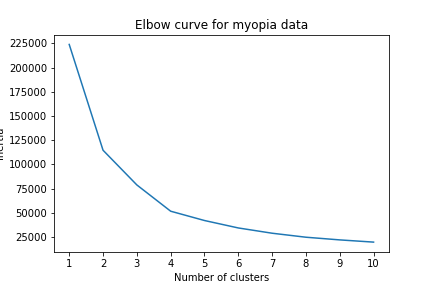
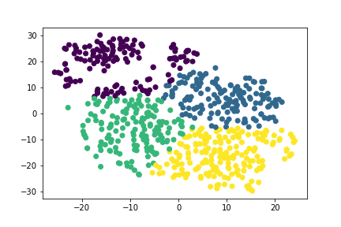

# unsupervised-learning
## Description/Background
This repo contains code which performs machine learning on a dataset of patients with myopia, in the hopes of determining distinct clusters of patients that might be analyzed separately. These clusters are determined as follows:
*performing dimensionality reduction using PCA and t-SNE
*performing a cluster analysis using K-Means

## Recommendations & Visualizations of clusters:
Based on the above analysis, the optimal number of clusters for this patient cohort is k=4. 

## Methods:
* PCA
* t-SNE
* K-means

## Technologies:
* Python
* Jupyter Notebook
* Pandas
* SciKitLearn

## Data Source
Data can be found at: "Instructions/myopia.csv"

Reduced dataset from [Orinda Longitudinal Study of Myopia conducted by the US National Eye Institute](https://clinicaltrials.gov/ct2/show/NCT00000169)

